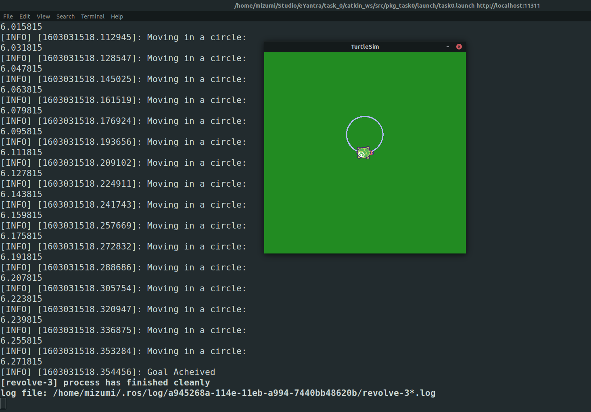

# Task 0

#### Used the `turtlesim` module to make the turtle complete one circle using `ROS Topics`

1. Published `Twist` messages to `/turtle1/cmd_vel` topic to control the turtle velocity,
2. Subscribed to `/turtle1/pose` topic to get the close to real time position of the turtle and 
3. Used `Pose` messages to stop the turtle after revolving an angle of `2 * pi` radians.

# Screenshot

